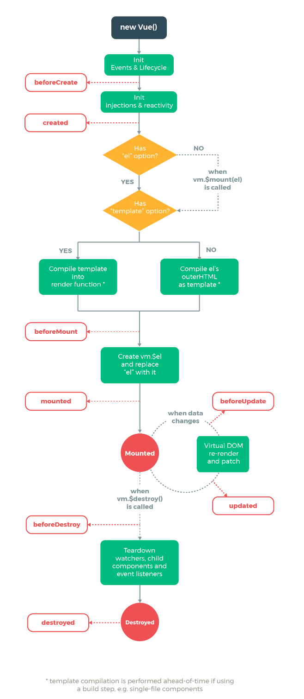

#vue标签
- v-model="inputValue" //获取标签内容
- v-for="(item, key, index) of list" //遍历list的item，还可用in，推荐使用of。  
- v-on:click="" == @click="" //绑定点击事件
- v-bind:Receive="afferent" == :Receive="afferent" //接收传入的值
- v-on:sendOut="implement" == @sendOut="implement" //监听函数，并执行"implement"
- v-text="content" == {{content}} //模板语法，content为js表达式  
- v-html="htmlContent" //转译输出  
- v-if="" //条件，false时DOM被注释  
- v-else="" //对应上层v-if，两者必须<b>紧贴</b>使用  
- v-else-if="" //v-if拓展  
- v-show="" //false时DOM；display="none"  
- :key="" //vue元素识别   
#vue方法
- vm.$destroy() //销毁vm实例
#vue实例
```
var vm = new ({ //创建vue实例，接管页面某部分的DOM的渲染，根实力  
    el: '#app', //定义vue实例接管的DOM的标签  
    components: { //定义新的模块实例  
        TodoItem: TodoItem  
    },  
    data: { //存放数据  
        list: [], //遍历的list，调用方式v-for="item in list"  
        inputValue: '', //数据双向绑定，v-model=""  
    }
    props: [""], //接收传入的值  
    template: "", //html标签  
    methods: { //定义函数  
        heanleItemClick: function () {  
            // alert("click");  
            this.$emit("sendOut", this.index);  //向外部发送信息  
        }  
    },
    computed: { //计算属性，缓存机制，相比于方法性能更高  
        fullName: function () {  
            return this.firstName + " " + this.lastName  
        }  
        get:function () {}, //输出  
        set: function (value) {}, //获取  
    },   
    watch: {}, //侦听器   
})  

<item></item> //使用方式  
Vue.component('item',{ //创建模块实例  
    template: "<div>Hello world</div>", //定义实例模板   
})  
```
#vue数组方法
- pop() //删除数组最后一项  
- push() //向数组增加一条数据  
- shift() //删除数据第一项  
- unshift() //向数组第一项增加一条数据  
- splice() //截取数据  
- sort() //对数组进行排序  
- reverse() //对数组取反  
- set()  
#vue生命周期
- vue生命周期图  
<div align="center">  
- vue生命周期钩子  
    - beforeCreate //初始化之前  
    - created //初始化完成  
    - beforeMount //实例渲染之前  
    - mounted //实例渲染完成  
    - beforeDestroy //实例销毁之前  
    - destroyed //实例销毁完成  
    - beforeUpdate //实例更新之前  
    - updated //实例更新完成
